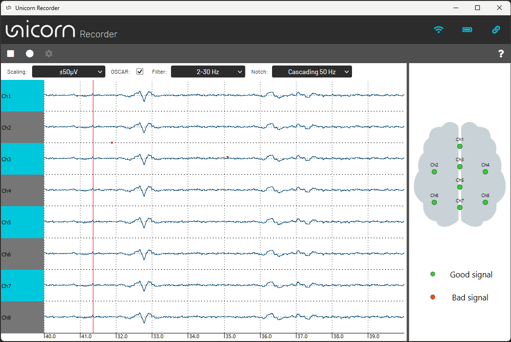

# Unicorn Recorder Hybrid Black

Unicorn Recorder is an application used to acquire, visualize and record data from Unicorn devices. The Unicorn Recorder allows you to process raw EEG with pre-defined Notch and Bandpass filters. Recorded data can be stored in a CSV or BDF files. You can also stream data to external applications via LSL or UDP.

[Starting Unicorn Recorder from Unicorn Suite](#starting-unicorn-recorder-from-unicorn-suite)<br/>
[Application](#application)<br/>
&nbsp;&nbsp;&nbsp;[Control bar](#control-bar)<br/>
&nbsp;&nbsp;&nbsp;&nbsp;&nbsp;&nbsp;[Start/Stop acquisition](#1-startstop-acquisition)<br/>
&nbsp;&nbsp;&nbsp;&nbsp;&nbsp;&nbsp;[Record](#2-record)<br/>
&nbsp;&nbsp;&nbsp;&nbsp;&nbsp;&nbsp;[Settings](#3-settings)<br/>
&nbsp;&nbsp;&nbsp;&nbsp;&nbsp;&nbsp;&nbsp;&nbsp;&nbsp;[Acquisition settings](#acquisition-settings)<br/>
&nbsp;&nbsp;&nbsp;&nbsp;&nbsp;&nbsp;&nbsp;&nbsp;&nbsp;[Recording settings](#recording-settings)<br/>
&nbsp;&nbsp;&nbsp;&nbsp;&nbsp;&nbsp;&nbsp;&nbsp;&nbsp;&nbsp;&nbsp;&nbsp;[CSV file format](#csv-file-format)<br/>
&nbsp;&nbsp;&nbsp;&nbsp;&nbsp;&nbsp;&nbsp;&nbsp;&nbsp;&nbsp;&nbsp;&nbsp;[BDF file format](#bdf-file-format)<br/>
&nbsp;&nbsp;&nbsp;&nbsp;&nbsp;&nbsp;&nbsp;&nbsp;&nbsp;[Network settings](#network-settings)<br/>
&nbsp;&nbsp;&nbsp;&nbsp;&nbsp;&nbsp;&nbsp;&nbsp;&nbsp;&nbsp;&nbsp;&nbsp;[Receiving triggers via UDP](#receiving-triggers-via-udp)<br/>
&nbsp;&nbsp;&nbsp;&nbsp;&nbsp;&nbsp;&nbsp;&nbsp;&nbsp;&nbsp;&nbsp;&nbsp;[Sending data via LSL](#sending-data-via-lsl)<br/>
&nbsp;&nbsp;&nbsp;&nbsp;&nbsp;&nbsp;&nbsp;&nbsp;&nbsp;&nbsp;&nbsp;&nbsp;[Sending data via UDP](#sending-data-via-udp)<br/>
&nbsp;&nbsp;&nbsp;&nbsp;&nbsp;&nbsp;&nbsp;&nbsp;&nbsp;[Device settings](#device-settings)<br/>
&nbsp;&nbsp;&nbsp;[Processing and display settings](#processing-and-display-settings)<br/>
&nbsp;&nbsp;&nbsp;&nbsp;&nbsp;&nbsp;[Amplitude range](#amplitude-range)<br/>
&nbsp;&nbsp;&nbsp;[Scope](#scope)<br/>
&nbsp;&nbsp;&nbsp;[Signal quality scope](#signal-quality-scope)<br/>

## Starting Unicorn Recorder From Unicorn Suite

The Unicorn Recorder can be started from the Unicorn Suite. Unicorn Recorder is listed in the Unicorn Suite in the 'Apps' section. Before being able to start Unicorn Recorder, the application must be unlocked using the license manager. The Unicorn must be paired before using it with the Unicorn Recorder. If the Unicorn is paired, the serial number of the device should be listed in the drop-down box in the Unicorn Suite. Select the serial number and press open, start the Unicorn Recorder with the selected device.

<p align="center">
<br/>
</p>

This dialog is displayed if the connection attempt failed. Make sure that the device is turned on and paired before using the Unicorn Recorder.

<p align="center">
<br/>
</p>

## Application

<p align="center">
<br/>
</p>

### Control bar
<p align="center">
<br/>
</p>

### 1. Start/Stop acquisition

This button initiates or halts data acquisition. The play button is visible when the device is connected and data acquisition is not active. Press the play button to initiate data acquisition. Data will be displayed after the play button was clicked. The stop button is visible if a data acquisition or recording session is currently active. To terminate a running data acquisition or recording session, press the stop button.

### 2. Record

This button initiates or halts data recording. If data acquisition is not initiated data acquisition and recording are initiated; if data acquisition is running, the recording module is attached according to the current recording configuration. 

### 3. Settings

### Acquisition settings

<p align="center">
<br/>
</p>

Acquisition parameters can be modified in the acquisition dialog. It is possible to switch the unicorn input source between 'electrode' and 'test signal'. A rectangular test-signal will be acquired if 'test signal' is selected. The input of the eight Unicorn Hybrid EEG Electrodes will be acquired if 'electrode' is selected. You can also include or exclude Accelerometer, Gyroscope, Battery Level, Counter, Validation Indicator or Timing from data acquisition. Included signals will be written to files and network streams if enabled. 

The default order is:

Ch. 1 - EEG 1 - EEG channel 1<br/>
Ch. 2 - EEG 2 - EEG channel 2<br/>
Ch. 3 - EEG 3 - EEG channel 3<br/>
Ch. 4 - EEG 4 - EEG channel 4<br/>
Ch. 5 - EEG 5 - EEG channel 5<br/>
Ch. 6 - EEG 6 - EEG channel 6<br/>
Ch. 7 - EEG 7 - EEG channel 7<br/>
Ch. 8 - EEG 8 - EEG channel 8<br/>
Ch. 9 - ACC X - Accelerometer X<br/>
Ch. 10 - ACC Y - Accelerometer Y<br/>
Ch. 11 - ACC Z - Accelerometer Z<br/>
Ch. 12 - GYR X - Gyroscope X<br/>
Ch. 13 - GYR Y - Gyroscope Y<br/>
Ch. 14 - GYR Z - Gyroscope Z<br/>
Ch. 15 - CNT - Counter<br/>
Ch. 16 - BAT - Battery Level<br/>
Ch. 17 - VALID - Validation Indicator <br/>
Ch. 18 - DT - Delta time<br/>
Ch. 19 - STATUS - Status / Trigger Value<br/>

### Recording settings

Data can be recorder to BDF or CSV files. It is possible to select the recording format in the 'Recording' settings. 'Folder path' and 'File prefix' can be modified as well. The default 'Folder path' is set to 'C:\Users\<username>\Documents\gtec\Unicorn Suite\Hybrid Black\Unicorn Recorder' and the 'File prefix' is set to 'UnicornRecorder'.

<p align="center">
<br/>
</p>

#### CSV file format

If CSV logging is enabled data is stored in serialized, comma-seperated format. The number of columns depend on configuration defined in the [Acquisition Settings](#acquisition-settings)..

<p align="center">
<br/>
</p>

#### Loading CSV files in Matlab

An import script is provided to read the Unicorn Recorder file into Matlab. Open Matlab and select “Set Path”. 

Add the folder:

 'C:\Users\<username>\Documents\gtec\Unicorn Suite\Hybrid Black\Unicorn Recorder\MATLAB Tools'

 to the Matlab search path and click save.

```Matlab
[datastruct] = unicornrecorder_read(filename)
```
Imports a Unicorn Recorder data file and returns data, as well as recording information.

- Parameters:<br>
filename - String containing the name of file to import.
- Return:<br>
Matlab structure containing all information stored in the Unicorn Recorder data file.
- Remarks:<br>
Type “help unicornrecorder_read” into the Matlab command window for further information.<br>
Example usage:<br>
data = unicornrecorder_read('UnicornRecorder_20190122_220912.csv');

#### BDF file format

If BDF logging is enabled data is stored in the BDF+ file format. Data can be loaded from applications supporting BDF file format like EDFBrowser. The number of signals depend on configuration defined in the [Acquisition Settings](#acquisition-settings).

<p align="center">
<br/>
</p>

### Network settings

<p align="center">
<br/>
</p>

#### Receiving triggers via UDP

<p align="center">
<br/>
</p>

#### C# example

A C# example showing how to receive data from an external application is installed with Unicorn Recorder. 

The example is installed to 

'C:\Users\<username>\Documents\gtec\Unicorn Suite\Hybrid Black\Unicorn Recorder\Examples\UDP Trigger Sender'

<p align="center">
<br/>
</p>

#### Code snippets

These exsamples show how to send triggers from an external application to Unicorn Recorder. The trigger value must be sent as a as ASCII character via UDP in order to be received properly.

This C# example can be modified and integrated into an application:

```C#
//Initialize socket
socket = new Socket(AddressFamily.InterNetwork, SocketType.Dgram, ProtocolType.Udp);
socket.EnableBroadcast = true;
endPoint = new IPEndPoint(IPAddress.Parse("127.0.0.1"), 1000);
socket.Connect(endPoint);

//Send trigger
byte[] sendBytes = Encoding.ASCII.GetBytes("1");
socket.SendTo(sendBytes, endPoint);
```

This Python example can be modified and integrated into an application:

```Python
import socket

# Initialize socket
socket = socket.socket(socket.AF_INET, socket.SOCK_DGRAM)
endPoint = ("127.0.0.1", 1000)

# Send trigger
sendBytes = b"1"
socket.sendto(sendBytes, endPoint)
```

#### Sending data via LSL
TBD

#### C# example

#### Sending data via UDP
TBD

#### C# example


#### Device settings

<p align="center">
<br/>
</p>

### 4. Help
The help button opens the user manual.

### Processing and display settings
TBD

#### Amplitude range
TBD

#### Filters
TBD

#### OSCAR
TBD

### Data viewer
<p align="center">
<br/>
</p>

he Data Viewer displays incoming data in real-time.  All channels provided by the Unicorn are listed underneath. The data viewer is limited to a time range of 10 seconds. 

### Signal quality scope

<p align="center">
<br/>
</p>

The signal quality scope provides feedback about the signal quality. Therefore, the raw EEG is filtered to a certain frequency range where amplitude variations are observed. It takes about 30 seconds until the filters have stabilized and the signal quality scope is reliable. If Unicorn Hybrid EEG Electrodes are not setteling in the expected amplitude range, electrodes turn red, indicating bad signal quality. All Unicorn Hybrid EEG Electrodes should turn green if the EEG amplitude stays in a proper range.