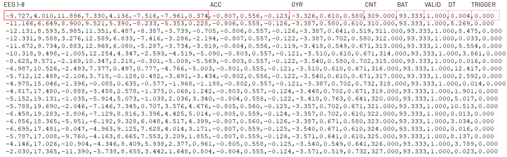

# Unicorn Recorder Hybrid Black

Unicorn Recorder is an application used to acquire, visualize and record data from Unicorn devices. The Unicorn Recorder allows you to process raw EEG with pre-defined Notch and Bandpass filters. Recorded data can be stored in a CSV or BDF files. You can also stream data to external applications via LSL or UDP.

[Starting Unicorn Recorder from Unicorn Suite](#starting-unicorn-recorder-from-unicorn-suite)<br/>
[Application](#application)<br/>
&nbsp;&nbsp;&nbsp;[Control bar](#control-bar)<br/>
&nbsp;&nbsp;&nbsp;&nbsp;&nbsp;&nbsp;[Start/Stop acquisition](#1-startstop-acquisition)<br/>
&nbsp;&nbsp;&nbsp;&nbsp;&nbsp;&nbsp;[Record](#2-record)<br/>
&nbsp;&nbsp;&nbsp;&nbsp;&nbsp;&nbsp;[Settings](#3-settings)<br/>
&nbsp;&nbsp;&nbsp;&nbsp;&nbsp;&nbsp;&nbsp;&nbsp;&nbsp;[Acquisition settings](#acquisition-settings)<br/>
&nbsp;&nbsp;&nbsp;&nbsp;&nbsp;&nbsp;&nbsp;&nbsp;&nbsp;[Recording settings](#recording-settings)<br/>
&nbsp;&nbsp;&nbsp;&nbsp;&nbsp;&nbsp;&nbsp;&nbsp;&nbsp;&nbsp;&nbsp;&nbsp;[CSV file format](#csv-file-format)<br/>
&nbsp;&nbsp;&nbsp;&nbsp;&nbsp;&nbsp;&nbsp;&nbsp;&nbsp;&nbsp;&nbsp;&nbsp;[BDF file format](#bdf-file-format)<br/>
&nbsp;&nbsp;&nbsp;&nbsp;&nbsp;&nbsp;&nbsp;&nbsp;&nbsp;[Network settings](#network-settings)<br/>
&nbsp;&nbsp;&nbsp;&nbsp;&nbsp;&nbsp;&nbsp;&nbsp;&nbsp;&nbsp;&nbsp;&nbsp;[Receiving triggers via UDP](#receiving-triggers-via-udp)<br/>
&nbsp;&nbsp;&nbsp;&nbsp;&nbsp;&nbsp;&nbsp;&nbsp;&nbsp;&nbsp;&nbsp;&nbsp;[Sending data via LSL](#sending-data-via-lsl)<br/>
&nbsp;&nbsp;&nbsp;&nbsp;&nbsp;&nbsp;&nbsp;&nbsp;&nbsp;&nbsp;&nbsp;&nbsp;[Sending data via UDP](#sending-data-via-udp)<br/>
&nbsp;&nbsp;&nbsp;&nbsp;&nbsp;&nbsp;&nbsp;&nbsp;&nbsp;[Device settings](#device-settings)<br/>
&nbsp;&nbsp;&nbsp;[Processing and display settings](#processing-and-display-settings)<br/>
&nbsp;&nbsp;&nbsp;&nbsp;&nbsp;&nbsp;[Amplitude range](#amplitude-range)<br/>
&nbsp;&nbsp;&nbsp;&nbsp;&nbsp;&nbsp;[Filters](#filters)<br/>
&nbsp;&nbsp;&nbsp;&nbsp;&nbsp;&nbsp;[Notch](#notch)<br/>
&nbsp;&nbsp;&nbsp;&nbsp;&nbsp;&nbsp;[OSCAR](#oscar)<br/>
&nbsp;&nbsp;&nbsp;[Scope](#scope)<br/>
&nbsp;&nbsp;&nbsp;[Signal quality scope](#signal-quality-scope)<br/>
[Using Unicorn Recorder for a research experiment](#using-unicorn-recorder-for-a-research-experiment)<br/>

## Starting Unicorn Recorder From Unicorn Suite

The Unicorn Recorder can be started from the Unicorn Suite. Unicorn Recorder is listed in the Unicorn Suite in the 'Apps' section. Before being able to start Unicorn Recorder, the application must be unlocked using the license manager. The Unicorn must be paired before using it with the Unicorn Recorder. If the Unicorn is paired, the serial number of the device should be listed in the drop-down box in the Unicorn Suite. Select the serial number and press open, start the Unicorn Recorder with the selected device.

<p align="center">
<br/>
</p>

This dialog is displayed if the connection attempt failed. Make sure that the device is turned on and paired before using the Unicorn Recorder.

<p align="center">
<br/>
</p>

## Application

<p align="center">
<br/>
</p>

### Control bar
<p align="center">
<br/>
</p>

### 1. Start/Stop acquisition

This button initiates or halts data acquisition. The play button is visible when the device is connected and data acquisition is not active. Press the play button to initiate data acquisition. Data will be displayed after the play button was clicked. The stop button is visible if a data acquisition or recording session is currently active. To terminate a running data acquisition or recording session, press the stop button.

### 2. Record

This button initiates or halts data recording. If data acquisition is not initiated data acquisition and recording are initiated; if data acquisition is running, the recording module is attached according to the current recording configuration. 

### 3. Settings

The settings dialog allows to configure acquisition, recording, network and device settings.

### Acquisition settings

<p align="center">
<br/>
</p>

Acquisition parameters can be modified in the acquisition dialog. It is possible to switch the unicorn input source between 'electrode' and 'test signal'. A rectangular test-signal will be acquired if 'test signal' is selected. The input of the eight Unicorn Hybrid EEG Electrodes will be acquired if 'electrode' is selected. You can also include or exclude Accelerometer, Gyroscope, Battery Level, Counter, Validation Indicator or Timing from data acquisition. Included signals will be written to files and network streams if enabled. 

The default order is:

Ch. 1 - EEG 1 - EEG channel 1 in microvolts<br/>
Ch. 2 - EEG 2 - EEG channel 2 in microvolts<br/>
Ch. 3 - EEG 3 - EEG channel 3 in microvolts<br/>
Ch. 4 - EEG 4 - EEG channel 4 in microvolts<br/>
Ch. 5 - EEG 5 - EEG channel 5 in microvolts<br/>
Ch. 6 - EEG 6 - EEG channel 6 in microvolts<br/>
Ch. 7 - EEG 7 - EEG channel 7 in microvolts<br/>
Ch. 8 - EEG 8 - EEG channel 8 in microvolts<br/>
Ch. 9 - ACC X - Accelerometer X in g<br/>
Ch. 10 - ACC Y - Accelerometer Y in g<br/>
Ch. 11 - ACC Z - Accelerometer Z in g<br/>
Ch. 12 - GYR X - Gyroscope X in deg/s<br/>
Ch. 13 - GYR Y - Gyroscope Y in deg/s<br/>
Ch. 14 - GYR Z - Gyroscope Z in deg/s<br/>
Ch. 15 - CNT - Counter<br/>
Ch. 16 - BAT - Battery Level in percent<br/>
Ch. 17 - VALID - Validation Indicator<br/>
Ch. 18 - DT - Delta time / Timespan between two received samples in milliseconds<br/>
Ch. 19 - STATUS - Status / Trigger Value<br/>

### Recording settings

Data can be recorder to BDF or CSV files. It is possible to select the recording format in the 'Recording' settings. 'Folder path' and 'File prefix' can be modified as well. 

The default 'Folder path' is set to:

```C:\Users\<username>\Documents\gtec\Unicorn Suite\Hybrid Black\Unicorn Recorder```
 
and the 'File prefix' is set to 'UnicornRecorder'

<p align="center">
<br/>
</p>

#### CSV file format

 Data is stored in serialized, comma-seperated format, if CSV logging is enabled. The number of columns depend on configuration defined in the [Acquisition Settings](#acquisition-settings)..

<p align="center">
<br/>
</p>

#### Loading CSV files in Matlab

An import script is provided to read the Unicorn Recorder file into Matlab. Open Matlab and select “Set Path”. 

Add the folder:

```C:\Users\<username>\Documents\gtec\Unicorn Suite\Hybrid Black\Unicorn Recorder\MATLAB Tools```

 to the Matlab search path and click save.

```Matlab
[datastruct] = unicornrecorder_read(filename)
```
Imports a Unicorn Recorder data file and returns data, as well as recording information.

- Parameters:<br>
filename - String containing the name of file to import.
- Return:<br>
Matlab structure containing all information stored in the Unicorn Recorder data file.
- Remarks:<br>
Type “help unicornrecorder_read” into the Matlab command window for further information.<br>
Example usage:<br>
data = unicornrecorder_read('UnicornRecorder_20190122_220912.csv');

#### BDF file format

Data is stored in the BDF+ file format if BDF logging is enabled. Data can be loaded from applications supporting BDF file format like EDFBrowser. The number of signals depend on configuration defined in the [Acquisition Settings](#acquisition-settings).

<p align="center">
<br/>
</p>

### Network settings

Unicorn Recorder features multiple network interfaces for sending triggers from an external application to Unicorn Recorder or data from Unicorn Recorder to an external application.

<p align="center">
<br/>
</p>

#### Receiving triggers via UDP

Triggers can be sent from an external application like a stimulus presentation tool via UDP

IP and Port can be modified. The default ip is set to the ```127.0.0.1```. The default port is set to `1000`. The port must differ from the port used for receiving triggers.

<p align="center">
<br/>
</p>

##### C# example

A C# example showing how to receive data from an external application is installed with Unicorn Recorder. 

The example is installed to 

```C:\Users\<username>\Documents\gtec\Unicorn Suite\Hybrid Black\Unicorn Recorder\Examples\UDP Trigger Sender```

<p align="center">
<br/>
</p>

##### Code snippets

These exsamples show how to send triggers from an external application to Unicorn Recorder. The trigger value must be sent as a as ASCII character via UDP in order to be received properly.

This C# example can be modified and integrated into an application:

```C#
//Initialize socket
socket = new Socket(AddressFamily.InterNetwork, SocketType.Dgram, ProtocolType.Udp);
socket.EnableBroadcast = true;
endPoint = new IPEndPoint(IPAddress.Parse("127.0.0.1"), 1000);
socket.Connect(endPoint);

//Send trigger
byte[] sendBytes = Encoding.ASCII.GetBytes("1");
socket.SendTo(sendBytes, endPoint);
```

This Python example can be modified and integrated into an application:

```Python
import socket

# Initialize socket
socket = socket.socket(socket.AF_INET, socket.SOCK_DGRAM)
endPoint = ("127.0.0.1", 1000)

# Send trigger
sendBytes = b"1"
socket.sendto(sendBytes, endPoint)
```

##### Example: Using keystrokes as triggers

This example shows how to use keystrokes as trigger for Unicorn Recorder.

```Python
import keyboard
import socket

def on_key_event(event):
    if event.event_type == keyboard.KEY_DOWN:
        sendBytes = ''
        if event.name == 'a':
            # Send trigger
            sendBytes = b"1"
        elif event.name == 's':
            # Send trigger
            sendBytes = b"2"

        #add your keys/triggers here

        if len(sendBytes)>0:
            print('Key: ' + event.name + ' Sending: ' + str(sendBytes))
            socket.sendto(sendBytes, endPoint)

# Initialize socket
socket = socket.socket(socket.AF_INET, socket.SOCK_DGRAM)
endPoint = ("127.0.0.1", 1000)

keyboard.on_press(on_key_event)
keyboard.wait('esc')
```

#### Sending data via LSL

It is possible to send data from Unicorn Recorder to an external application using LSL.

It is possible to modify the LSL streamname. The default streamname is set to ```UnicornRecorderLSLStream```.

##### C# example

A C# example showing how to receive data from Unicorn Recorder in C# via LSL.

The example is installed to 

```C:\Users\<username>\Documents\gtec\Unicorn Suite\Hybrid Black\Unicorn Recorder\Examples\LSL Receiver```

<p align="center">
<br/>
</p>

#### Sending data via UDP

It is possible to send data from Unicorn Recorder to an external application using UDP.

IP and Port can be modified. The default ip is set to the ```127.0.0.1```. The default port is set to `1001`. The port must differ from the port used for receiving triggers.

##### C# example

A C# example showing how to receive data from Unicorn Recorder in C# via UDP.

The example is installed to 

```C:\Users\<username>\Documents\gtec\Unicorn Suite\Hybrid Black\Unicorn Recorder\Examples\UDP Receiver```

<p align="center">
<br/>
</p>

#### Device settings

Device information can be read in the device dialog. The serial number and software versions of the Unicorn Brain Interface currently used are displayed in this dialog. Additionally, the digital outputs can be controlled within this dialog.

<p align="center">
<br/>
</p>

### 4. Help
The help button opens the user manual.

### Processing and display settings

It is possible to modify signal processing and data visualization using this toolbar.

<p align="center">
<br/>
</p>

#### Amplitude range
The amplitude range changes the displayed amplitude range of all EEG channels in the [Data Viewer](#data-viewer). 

#### Filters

The 'Filter' box allows you to apply predefined IIR filters to the raw data to extract specified frequency bands and remove artifacts. Predefined filters settings are:

- 0.1 – 30 Hz Bandpass
- 0.1 – 50 Hz Bandpass
- 0.5 – 30 Hz Bandpass
- 0.5 – 50 Hz Bandpass
- 1 – 30 Hz Bandpass
- 1 – 50 Hz Bandpass
- 2 – 30 Hz Bandpass
- 2 – 50 Hz Bandpass
-  $\gt$ 0.1 Hz Highpass
-  $\gt$ 0.5 Hz Highpass
-  $\gt$ 1 Hz Highpass
-  $\gt$ 2 Hz Highpass
-  $\lt$ 20 Hz Lowpass
-  $\lt$ 50 Hz Lowpass
- None - No filter applied

#### Notch

The 'Notch' box allows you to apply predefined IIR filters to the raw data to remove power line hum from data.

- 50 Hz 
- 60 Hz 
- 50 & 60 Hz 
- Cascading 50 Hz - removes 50 Hz and multiples
- Cascading 60 Hz - removes 60 Hz and multiples
- Cascading 50 & 60 Hz  - removes 50, 60 Hz and multiples
- None - No filter applied

#### OSCAR

OSCAR is a real-time pre-processing module that removes motion, cable, blink, and other artifacts from EEG signals. It saves valuable data and time and enables BCI experiments under difficult conditions. Oscar can be activated or deactivated from the check box.

### Data viewer
<p align="center">
<br/>
</p>

he Data Viewer displays incoming data in real-time.  All channels provided by the Unicorn are listed underneath. The data viewer is limited to a time range of 10 seconds. 

### Signal quality scope

<p align="center">
<br/>
</p>

The signal quality scope provides feedback about the signal quality. Therefore, the raw EEG is filtered to a certain frequency range where amplitude variations are observed. It takes about 30 seconds until the filters have stabilized and the signal quality scope is reliable. If Unicorn Hybrid EEG Electrodes are not setteling in the expected amplitude range, electrodes turn red, indicating bad signal quality. All Unicorn Hybrid EEG Electrodes should turn green if the EEG amplitude stays in a proper range.

## Using Unicorn Recorder for a research experiment

This image illustrates a typical use case for BCI research. It shows the capability to send a trigger from an external stimulus presentation framework to 'Unicorn Recorder', synchronizing the trigger with the data captured by 'Unicorn Recorder' ([Receiving triggers via UDP](#receiving-triggers-via-udp)). Both the data and trigger can then be transmitted to an external application using network outputs for real-time processing ([Network Settings](#network-settings)) using [UDP](#sending-data-via-udp) or [LSL](#sending-data-via-lsl). Additionally, the trigger and data can be processed offline from the BDF or CSV recordings ([Record Settings](#recording-settings)).

<p align="center">
<br/>
</p>